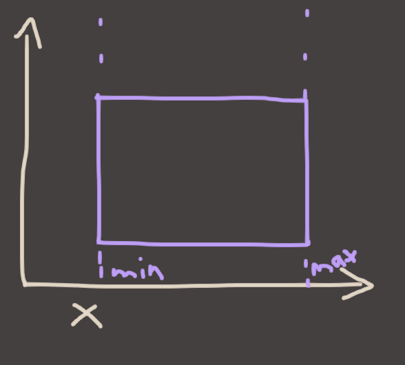
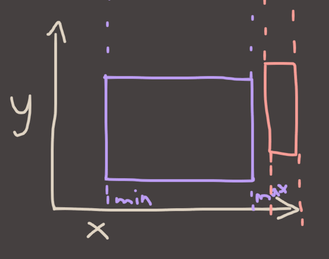
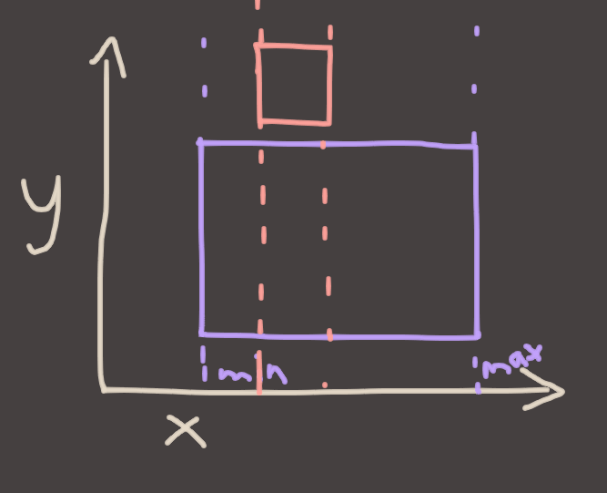

# Euan's Way-Too-Long Collision Detection Thing

Hello everyone, welcome to my TEDTalk. This was supposed to be a quick explainer on basic collision detection of AABBs and Circles, but it kind of ballooned out into a mini-course. I hope it's useful cuz it took way longer than I expected.

## AABB Tests

### Simplify First: One Dimension

Conceptually, an AABB is a set of `n` ranges where `n` is the number of dimensions you're dealing with. To make that a bit more concrete, let's start with one dimension. Consider a line segment.


A "Line" would be the white-ish line in this drawing, and it goes to infinity in both directions. A "Ray" can be defined as "Half A Line". That is, it has a beginning, but it has no end. It starts somewhere and goes to infinity. A "Line Segment" has a beginning *and* an end. There's some terminology for ya!
 
Now let's consider a second line segment:


Now ask yourself the question, **"do these lines overlap?"** The answer is clear from the picture, but if you only had the `min`/`max` values for both lines, could you work it out?

If you were to think about this for a while, you might try to consider all of the cases for how they can overlap, but I'll do you a favour and tell you: it's easier to think of the ways that they can **not** overlap. Why? Because there's only a couple of 'em.


Either the red line segment is completely to the left of the blue one, or the red line is completely to the right of the blue one. If either of those is true, then the lines don't overlap.

Another way of stating this is that

> if the left-most (ie: the minimum) point on the red line is to the right (greater than) of the right-most (maximum) of the blue line, no overlap exists. Or vica verca.

That becomes a simple test to structure!

```!(red.max < blue.min || blue.max < red.min)```

or rephrased to avoid the !..

```(red.max > blue.min && blue.max > red.min)```

### Boxes

So that's cool. But those are lines, lines aren't boxes, fuck off with your lines and min/maxes Euan we're doing boxes today and I don't see any boxes.

Don't worry, we're half way there! we have a 1D test, we just need to extend it into 2D. Consider a box.


Now let's draw some axes on it.


so we already know how to test overlaps on lines. And the X axis is a line, right? so..



If we introduce a second box, we can now do the exact same test to see if they overlap in X.



if they don't overlap in 1D, then they cannot overlap in 2D. Look at this picture and try to imagine a place where you can put the red box where it overlaps with purple, without the min/max ranges overlapping in the X axis. Can't do it! 

That's actually a general truth for all convex shapes, which is cool. But what about if they do overlap in X?



**They still might not overlap.** The way we test to see if they do, as you might've guessed.. is to do the exact same thing we did before. We just do it on the other axis.

### Getting To The Point 

Using our overlapping test idea from before, we can extend to two dimensions.

```
(red.max.x > purple.min.x && purple.max.x > red.min.x)
(red.max.y > purple.min.y && purple.max.y > red.min.y)
```

But there's one question left I guess, which is how do we **combine** these? Is it overlapping if either of the two 1D tests are true? or both of them?

The answer is, it has to be both. Because as we just saw, you can quite happily overlap in one dimension and not the other, and still not be overlapping as a 2D shape. **Every dimension has to overlap for the shapes to actually overlap.**

So our final test is:

```
bool
AABBOverlapsAABB(const AABB& a, const AABB& b)
{
	return
	(a.max.x > b.min.x && b.max.x > a.min.x) &&
	(a.max.y > b.min.y && b.max.y > a.min.y);
}

```

And there's the 2D case. The 3D case would be the exact same thing, you'd just add a .z test in there, in the exact same fashion.

As a sidenote, this is the code for this kind of AABB:

```
struct AABB
{
	Vector2 min, max;
}
```

If your AABBs are stored differently, this might be more what you're looking for. Hopefully you can see how they are equivalent!

```
struct AABB
{
	Vector2 pos, dim;
}

bool
AABBOverlapsAABB(const AABB& a, const AABB& b)
{
	Vector2 aMax = a.pos + a.dim;
	Vector2 bMax = b.pos + b.dim;

	return
	(aMax.x > b.pos.x && bMax.x > a.pos.x) &&
	(aMax.y > b.pos.y && bMax.y > a.pos.y);
}
```

So that's AABB tests in a nutshell.