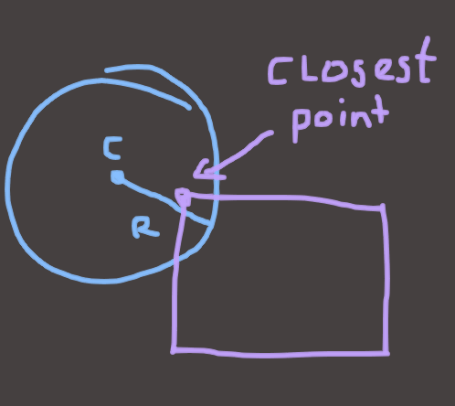
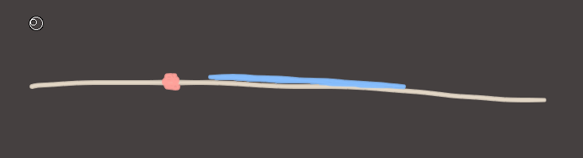
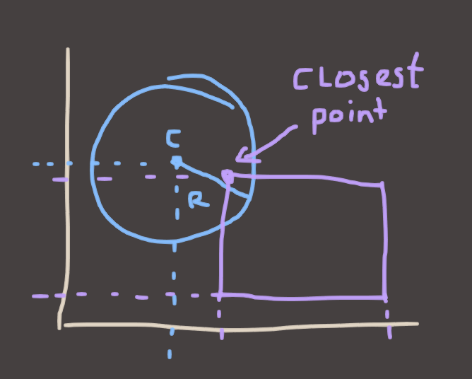

## Circles vs AABBs

The next thing you'd probably want is a circle vs AABB test, because balls are not, and this is true.. boxes. The most convenient form for a circle to take when it comes to collision detection is something like this.

```
struct circle
{
	Vector2 center;
	float radius;
}
```

To find whether a circle overlaps with something, you can find the distance between the circle's center and the object you're testing against, and compare that to the circle's radius. If that distance is smaller than the radius, then it's overlapping!



"That's all well and good Euan but how the fuck am I supposed to know where the closest point is?" Great question, and there's two answers, the good one and the easy one. Let's stick to the easy one. Again, let's make life easy by going down to 1D. Imagine a line and a range once again. What is the "closest point" to the red dot on the blue line?



If you think about this problem for a bit, you'll see that there's basically 3 possible solutions. In the picture I showed, the closest point on the line is actually the line's **minimum**. If the red dot were on the other side (to the right of the line) then it would be the **maximum**. And if the dot was somewhere on the line then the **position of the dot itself** would be the closest point.

That's also pretty easy to phrase in code.

```
if(redDot < blueLine.min) return blueLine.min;
if(redDot > blueLine.max) return blueLine.max;
else return redDot;
```

The smart people among you might have noticed that this can also be phrased as:

```
max(blueLine.min, min(blueLine.max, redDot);
```

or even more succinctly, if you have a library that does these things..
```
// Clamp(x, min, max)
Clamp(redDot, blueLine.min, blueLine.max);
```

And once again, this scales to 2 dimensions very easily.



In this example, the `center` of the circle is greater than `max.y` in Y, so we take `max.y`, and less than `min.x` in X, so we take `min.x`.

In code:

```
Vector2
ClosestPointInAABBToPoint(const AABB& aabb, const Vector2& point)
{
	Vector2 result;

	result.x = Clamp(point.x, aabb.min.x, aabb.max.x);
	result.y = Clamp(point.y, aabb.min.y, aabb.max.y);

	return result;
}
```

So now all that's left to do is measure the distance between our circle's center and it's closest point in the AABB. If the point is closer to the circle's center than the radius, then that point is inside the circle, and we have an overlap.

```
bool
CircleOverlapsAABB(const Circle& circle, const AABB& aabb)
{
	Vector2 closestPoint = ClosestPointInAABBToPoint(aabb, circle.center);
	Vector2 difference = closestPoint - circle.center;

	if(magnitude(difference) < circle.radius) return true;
	else return false;
}
```

The magnitude of the vector, as you'll remember from Freya's lectures, just the dot product of a vector and itself. And the Dot product, as you'll also remember, is just the sum of all of the components, multiplied together.

```
float
dot(const Vector2& a, const Vector2& b)
{
	return a.x * b.x + a.y * b.y;
}

float
sqMagnitude(const Vector2& v)
{
	return dot(v, v);
}

float
Vector2::magnitude(const Vector2& v)
{
	return sqrt(sqMagnitude(v));
}
```

If you're fancy, though, you'll probably know that for this kind of `>` or `<` comparison, you don't actually *need* the magnitude of the vector. You can skip the square root and just do this instead: 

```
bool
CircleOverlapsAABB(const Circle& circle, const AABB& aabb)
{
	Vector2 closestPoint = ClosestPointInAABBToPoint(aabb, circle.center);
	Vector2 difference = closestPoint - circle.center;

	return (sqMagnitude(difference) < circle.radius * circle.radius);
}
```


