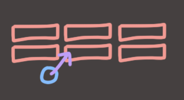
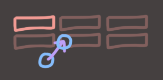
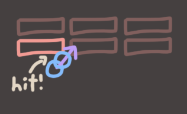
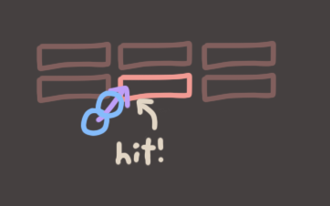
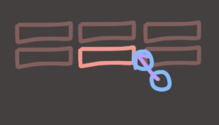
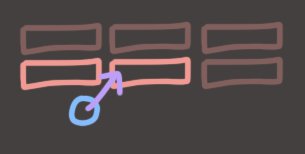

## Collision Ordering (A Brief Aside)

I saw on Discord that some of you (okay, *at least* one of you) has hit the somewhat classic bug of collision ordering. Let me explain what that is.

### The Problem

Let's say you have a set of `n` AABB colliders, and a ball that is bouncing off of them. You might write something like this:

```
for(int i = 0; i < blocks.size(); ++i)
{
	if(CircleVsAABB(ball, blocks[i]))
	{
		BounceBallFromBlock(ball, blocks[i]);
	}
}
```

That looks nice and logical. Let's see it in a picture.



In this example, our ball is flying towards the blocks and is surely going to hit one. We test against the first block. No hit, it seems.



We continue through the blocks until.. ooh! we found a hit! Ok, let's resolve that hit by reflecting the ball. Everything is working as it should! Great.



So anyways, then the algorithm *continues* and, lo and behold, we find **another hit**.



What does our algorithm do here?! Well it depends on how we wrote it. We might move the ball into a position where it intersects the previous block, then reflect it up-and-to-the-left, basically ignoring the first hit we got. We might change the ball's velocity twice, once to reflect it after the first hit, then again to reflect it after the second hit and end up bouncing back the way we came. We might teleport the ball by adding two separate offsets to it's position, one for the first collision and one for the second, and so on. It depends on how we wrote `BounceBallFromBlock()`.

### Not So Easy To Solve!

This might seem like a simple fix, right? Let's try the obvious stuff.

#### Write BounceBallFromBlock() *very carefully*?

Your first thought might be to prevent weird shit from happening inside `BounceBallFromBlock()` by trying to make it handle being called multiple times in a frame. Perhaps by removing any code that actually physically moves the ball, and only change velocity. Unfortunately this doesn't solve the underlying problem, and maybe you aren't quite sure why not? Let's try other stuff.. 

#### Try Stopping The Loop?

Let's say we just break out of the loop if we detect a collision. That's an improvement, because we don't get any bugs related to double-processing, right? Sure, but consider *this* situation..



If we just break the loop when a collision is found, then this situation will generate a hit on the center block while *allowing the ball to tunnel completely through* the right-side block **without ever checking it!**

#### The Ultimate Problem

Your collision detection algorithm is **order dependent** at this point. Whether your algorithm ignores everything except for the first collision it finds, or whether it tries to ignore everything but the last collision it finds, if you process the blocks in a different order, you may get a different result.

## The Solution

There's only one robust way to deal with this that I know of, I'm afraid. (There may be others, ask smarter people if you wanna know what they are!) 

When we find a collision, we record it. We don't *do* anything about it, we just make a note of it.

```
recordedCollisions.clear();
for(int i = 0; i < blocks.size(); ++i)
{
	if(CircleVsAABB(ball, blocks[i]))
	{
		auto newCollision = RecordedCollision(ball, blocks[i]);
		recordedCollisions.Add(newCollision);
	}
}
```

When this loop completes, recordedCollisions will have 0 or more collisions recorded in it. If there are 0, then nothing collided and we can go on our merry way. If 1 collision was recorded, then we can process that single collision and proceed as normal.

But in the case where *two or more* collisions were detected, we must be smart. Let's go back to our diagram. Which of these two collisions did we actually **want** to find?



We wanted the **first** one, sure. But *which* first one?

> The Problem was that we were accepting the first collision *we found*. We wanted to accept the first collision *that happened*.

The key factor that we're missing is **Time**.

### Time

Now, this puts an extra requirement on our `CircleVsAABB()`. Before now, all it had to do was tell us *if* a collision happened, now it suddenly has to know *when*?! Thankfully, if you have implemented the binary search method from before, you'll already have that information. Then it's just a matter of getting it out of the function!

### Two Solutions

Once we can get time out of our overlap test, we can use it to select the correct collision from the list. The simplest method for this is to keep track only of the *soonest* of all the collisions, and once you're sure there are no better collisions available, perform the move. (Note that this has problems in highly dynamic situations but for a single ball moving against static AABBs, this works just fine.)

```
RecordedCollision bestCollision;
float bestTime = INFINITY;
for(int i = 0; i < blocks.size(); ++i)
{
	float t; 
	if(CircleVsAABB(ball, blocks[i], &t))
	{
		if(t < bestTime)
		{
			bestTime = t;
			bestCollision = RecordedCollision(ball, blocks[i]);
		}
	}
}
if(bestTime < INFINITY)
{
	BounceBallFromBlock(ball, blocks[i]);
}
```

The second, more robust solution, is to accept the first collision and then *redo every single collision check*. This is necessary in the case where our ball was going to *miss* a given object, but then **bounced off of something else and flew into it anyways**. I won't cover this solution in detail, but hopefully you can see how you'd do it!

NEXT: [Minkowski Shennanigans](4.md)