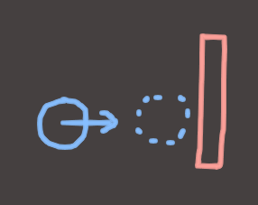
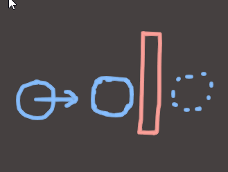
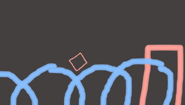
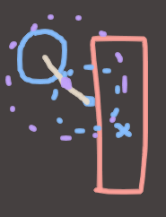
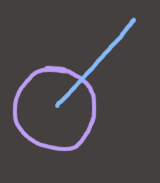
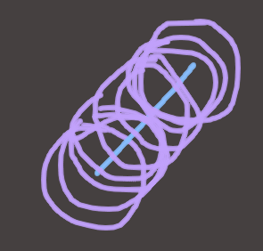
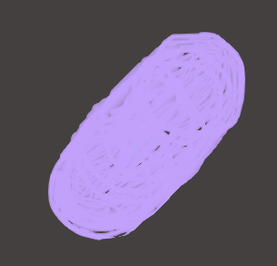
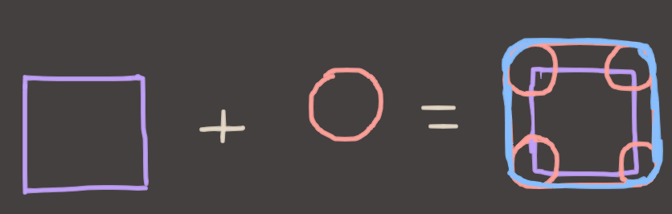
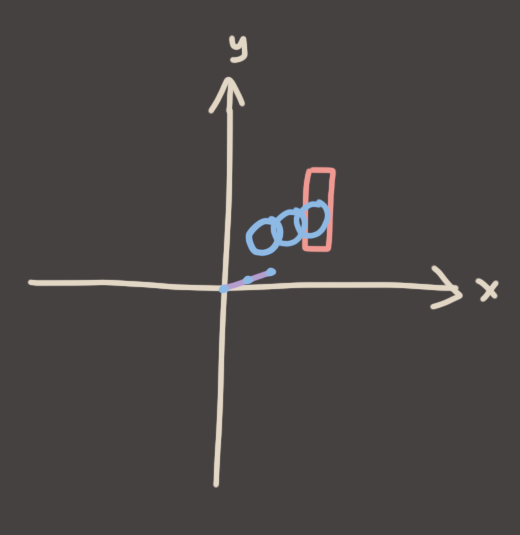
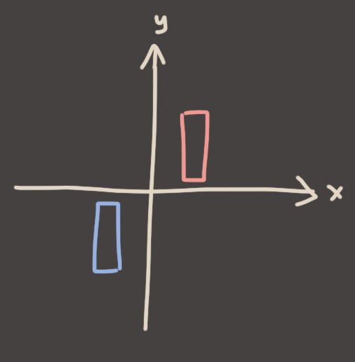

## Now With Movement

Those tests are all well and good if you're dealing with fixed positions, but games where things don't move are not very good games. If you want movement then problems with these techniques start to emerge.

First of all, let's talk about the phenomenon called Tunnelling. Tunnelling is when an electron's wave function collapses on the less probably side of an electric field or what Elon Musk does when he wants to get a taxi from downtown Las Vegas to the airport. It's also a bug in your collision code.

Imagine the earth is hurtling towards a gigantic, but very thin wall, and you're running collision detection to see if it hits the wall or not. (You are God in this scenario)

You first look at the Earth's velocity, and consider how much time has passed since the last time you looked at the Earth. Using this, you work out where the Earth should be, and check to see if it's overlapping.

Damn that's kinda close. No contact though, so it's kosher. (You are Yhwh in this scenario.) So you go off and do something else for a while and then come back later. You repeat the process. Step 1, use Velocity and Time Elapsed to work out where the Earth should be. Step 2, see if that new position collides with anything. Yep, looks good to me! All is good.

Hopefully you see the problem. So what's the solution?

### Solution Number 1: Just Update More, Bro! (The Dumb Method)

+ **PROS:** It's Easy
+ **CONS:** It's Shit

"That's dumb", you say. "Lookit those huge gaps. Only an idiot would have such huge gaps. Just run more updates and you'll be fine."

This is true. This totally works in most cases. But there are edge cases. For example, if we sample twice as often, but objects move twice as fast, then we have the same problems. Another edge case is very small colliders that slot into the lil' gaps.

That's not why it's a dumb solution, though. It's dumb because it's **inherently inaccurate**.

This Earthy Roundboy is about to hit this Bouncy Redboy and we want him to bounce off. We have clearly detected a collision, so now we do the bounce. How do we do that, exactly? Turn him around and throw him in the opposite direction, of course! But.. how do we DO that?

Option 1: He "bounces" from where he is.
Option 2: He "bounces" from where he "collided".

As you can see, neither of these options are what we actually wanted. Either we bounce him early, meaning he never touches the wall and actually bounces without touching, or he embeds himself into the surface then bounces himself out later (potentially causing another collision on the next frame, cuz now he's embedded inside the Bouncy Redboy)

These options both suck. They're inaccurate, and worse still, the degree of inaccuracy is dependent on the speed that Earthy was moving as well as the physics timestep we're choosing. In the worst-case, the consistency of collision detection can become dependent on the framerate! **Can you imagine a game where a lag spike causes you to FALL THROUGH THE FLOOR?!** Because that's the road you're on, my friend.

Clearly we can do better.

### Solution Number 2: Just Binary Search, Bro! (The Big Brain Method)

+ **PROS:** It (mostly) actually works
+ **CONS:** It's a lil' bit more complicated/expensive.

This is why they taught you algorithms dude. To prepare you for *THIS MOMENT*. Brace yerselves.

Imagine a circle that encompasses both the starting point and the projected ending point of our dear Earthy. This new circle would have it's center point in the exact center of the line between the start and end circle centers. I won't give the math away for anyone who wants to think about how to construct this circle, but if you want a hint, the center would be the average of the start and end circle centers and the radius would be half of the total distance, plus whatever the radii are of the two circles.

If we find nothing that collides with this bigger circle, then we know we have no collision and we can do the move, woop! But if we *DO* find a collision, we can, you guessed it, **BINARY SEARCH**! Redo the test, but replace the old endpoint with the midpoint.

If the new test collides, then we know the collision happens in the FIRST half of the travel time. If it doesn't, then we know it happens in the OTHER half. So we change our start and endpoints accordingly!

There's a caveat, though. Y'see this is.. sort of an infinite loop. It gets closer and closer to the right answer with every iteration, but you need to know when to tell it to stop. The best way to do that is to define some minimum timestep that you can take before you call it "good enough", then just exit recursion when you reach that value.

### Seems Good?

Why is this better? First of all, no tunnelling guarantee! Nothing will EVER tunnel in this system.

Second of all, it's as accurate as you want to make it! You choose the minimum timestep, so you choose how good of an answer you wanna get!

Sounds awesome right? Nothing could be better, right? It's got an algorithm in it and everything! Well then..

## Detour: Shapes, but Algebra

So you're sitting in your study tryin'a think about how time and space are like, the same or whatever, and you're playing with shapes moving through *tiiime*. (You are Hermann Minkowski in this scenario). You start with a circle, and a line representing it's path through spacetime.

Imagining that you could see time as if it was one of the other regular boring dimensions, you visualize the circle existing at all points along that line simultaneously and you see..

.. nah, more points than that..

.. no like.. all of them. infinitely many.

perfection.

### Wait, you can add shapes now?

Waow. So a **Circle, placed on every single point on a line segment is.. just a 2D capsule?** Waow, cool. How about other shapes, though? What else can we add? *ADD ALL THE SHAPES!*

Circles + Squares = Rounded Squares. (Distinct from Squircles, ask me about those after class) What about Triangles?

Some kind of weird polygon? Ok, cool. What happens if we flip the order? Instead of adding the Blue triangle to the Red triangle, what happens if we do the exact same process but reverse it by adding the Red triangle to the Blue one?

Damn, that looks like it might be the *exact same weird polygon*. (Or at least it looks like it would've been if I could draw..)

### we know *what* the shape is, but *where* is it?

We know what shape we'll end up with after combining our shapes, but I haven't yet talked about *where they are*. After all, it's kinda meaningless to say "Do these two shapes overlap?" if we don't know *where* they are. So let's draw some axes.

Here, the **purple line** represents the movement of the blue circle for this frame. (position + velocity * deltaTime.) Notice that I put the line segment representing the motion of the circle at zero. That's just something you do with vectors, and it makes this whole thing work. Don't question it, just believe in it!

Let's take the *origin* in the space in which we're doing the collision and then sweep the circle by moving the origin along that line. (I've only drawn in 3 points here, but imagine we're sweeping the entire line to get our 2d capsule shape again.)

We call this operation **Minkowski Addition** (pronounced *"Min-Kov-Skee"*) after the dude who invented it. And as you might expect, if you add, perhaps you can subtract?!

## Shape + Shape? Shape - Shape?!

What would subtraction mean, in this context? Well, from regular normal vanilla algebra, we know that `A - B = A + (-B)` Wait what, negative B? How do you negate a shape? Well it's simple. You mirror it through the origin. Again don't question it, just believe in it.

Here, the Red and Blue rectangles are negations of each other. They are mirrored along both the X and Y axes. I'd mirror them on the Z and W axes as well, if I had them.

The Minkowski Sum of `A + (-B)` is often called the **Minkowski Difference**. This is sort of the same as saying that `A - B` is the *difference* between A and B, which is something we can do with regular algebra. So it sort of makes sense, which is super cool 'n all but why are we even talking about this? Well, because of this general fact:

> **If the Minkowski Difference of two shapes encompasses the origin, then *those shapes are overlapping*.**

Equally useful is the fact that the the distance from the origin to the closest point on the Minkowski Difference of two shapes is always equal to the **shortest distance between the two shapes.**

Woah that's a lot to suddenly drop in there without any explanation. Let's do an example to test all of this theory. Here are two shapes that overlap.

So step 1, negate one of them.

Step 2, take the origin of one, and sweep it around inside of the other.

Step 3, does it overlap the origin? Yes!

Cool, now another example. This time they don't overlap. 

We repeat the steps. Negate the box..

Take the origin of the circle, swish it around inside the box to cover every possible point in the box..

..and check the origin. Overlap? No! And better yet, Check the closest point on the swept shape to the origin. What do you see? 

Well well well, what a coincidence. It seems to be telling us the distance between the two objects at their closest points. Damn this Minkowski stuff is cool.

Alright cool, I've explained the principle. Shape addition is a very useful and powerful idea. You'll see it hard at work inside the GJK (Gilbert/Johnson/Keerthi) algorithm if you want general-purpose convex polygon collision detection. But that's beyond what I'm prepared to type up today, so let's get back on track..

## Solution Number 3: Shit Just Got Real (The Actually Good Method)

### ... TO BE CONTINUED ...