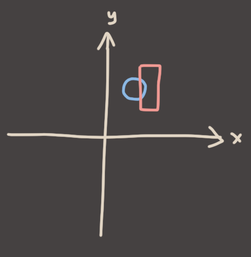
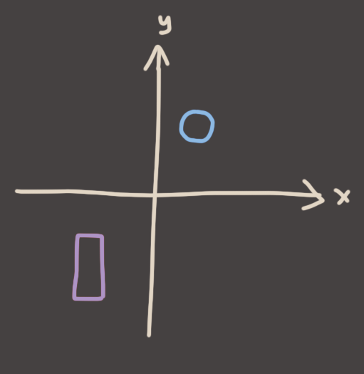
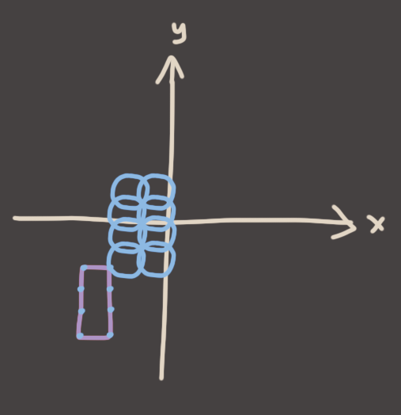
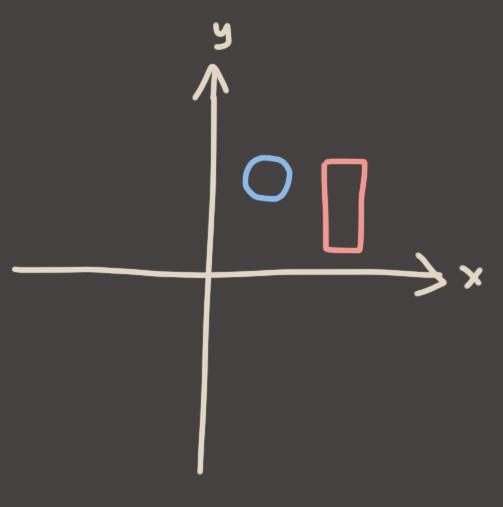
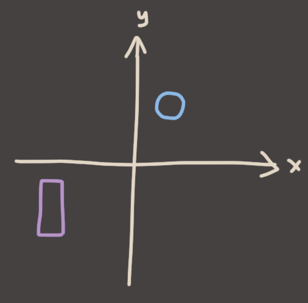
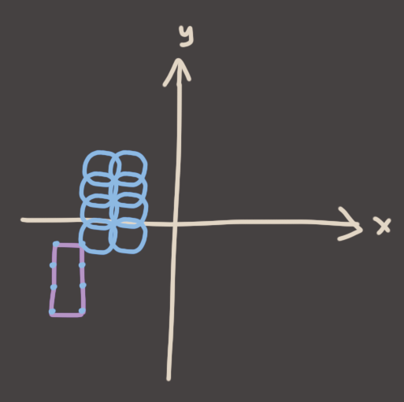
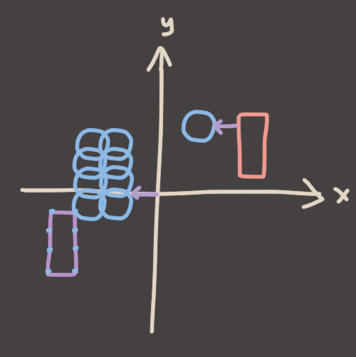

Here are two shapes that overlap.

So step 1, negate one of them.

Step 2, take the origin of one, and sweep it around inside of the other.

Step 3, does it overlap the origin? Yes!

Cool, now another example. This time they don't overlap. 

We repeat the steps. Negate the box..

Take the origin of the circle, swish it around inside the box to cover every possible point in the box..

..and check the origin. Overlap? No! And better yet, Check the closest point on the swept shape to the origin. What do you see? 

Well well well, what a coincidence. It seems to be telling us the distance between the two objects at their closest points. Damn this Minkowski stuff is cool.

Alright cool, I've explained the principle. Shape addition is a very useful and powerful idea. You'll see it hard at work inside the GJK (Gilbert/Johnson/Keerthi) algorithm if you want general-purpose convex polygon collision detection. But that's beyond what I'm prepared to type up today, so let's get back on track..

NEXT [Circle vs AABB Swept Collision](5.md)