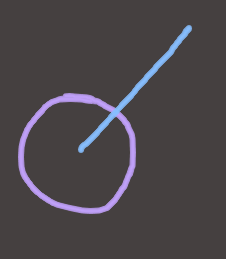
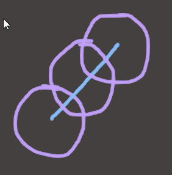
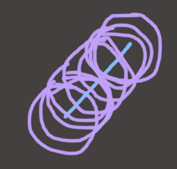
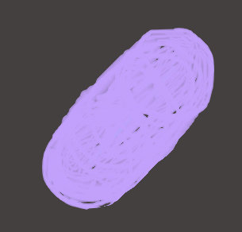
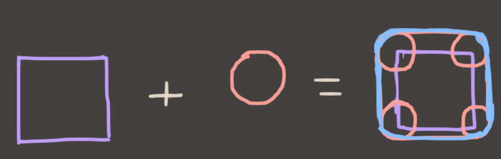
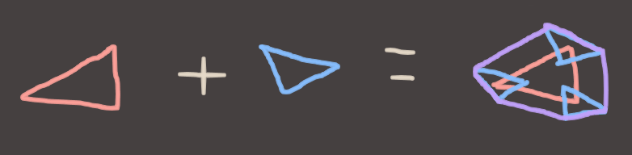
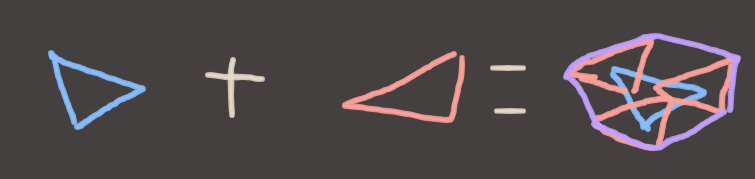
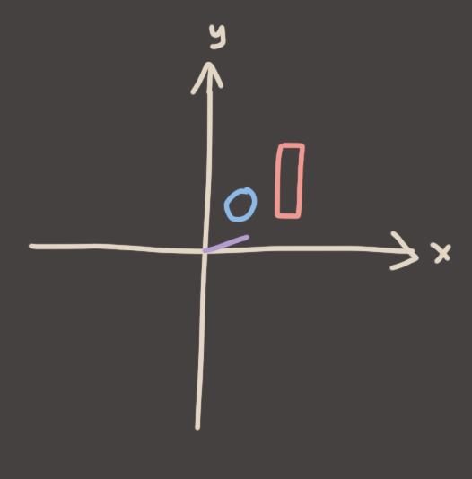
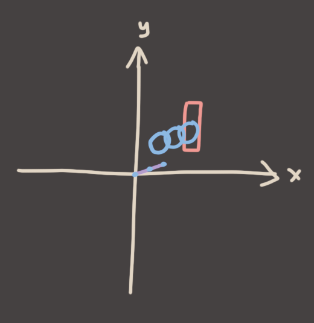
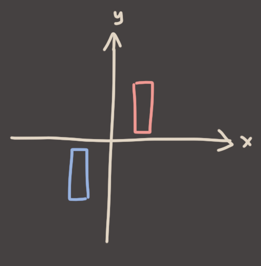

## Detour: Shapes, but Algebra

So you're sitting in your study tryin'a think about how time and space are like, the same or whatever, and you're playing with shapes moving through *tiiime*. (You are Hermann Minkowski in this scenario). You start with a circle, and a line representing it's path through spacetime.

Imagining that you could see time as if it was one of the other regular boring dimensions, you visualize the circle existing at all points along that line simultaneously and you see..

.. nah, more points than that..

.. no like.. all of them. infinitely many.

perfection.

### Wait, you can add shapes now?

Waow. So a **Circle, placed on every single point on a line segment is.. just a 2D capsule?** Waow, cool. How about other shapes, though? What else can we add? *ADD ALL THE SHAPES!*

Circles + Squares = Rounded Squares. (Distinct from Squircles, ask me about those after class) What about Triangles?

Some kind of weird polygon? Ok, cool. What happens if we flip the order? Instead of adding the Blue triangle to the Red triangle, what happens if we do the exact same process but reverse it by adding the Red triangle to the Blue one?

Damn, that looks like it might be the *exact same weird polygon*. (Or at least it looks like it would've been if I could draw..)

### we know *what* the shape is, but *where* is it?

We know what shape we'll end up with after combining our shapes, but I haven't yet talked about *where they are*. After all, it's kinda meaningless to say "Do these two shapes overlap?" if we don't know *where* they are. So let's draw some axes.

Here, the **purple line** represents the movement of the blue circle for this frame. (position + velocity * deltaTime.) Notice that I put the line segment representing the motion of the circle at zero. That's just something you do with vectors, and it makes this whole thing work. Don't question it, just believe in it!

Let's take the *origin* in the space in which we're doing the collision and then sweep the circle by moving the origin along that line. (I've only drawn in 3 points here, but imagine we're sweeping the entire line to get our 2d capsule shape again.)

We call this operation **Minkowski Addition** (pronounced *"Min-Kov-Skee"*) after the dude who invented it. And as you might expect, if you add, perhaps you can subtract?!

## Shape + Shape? Shape - Shape?!

What would subtraction mean, in this context? Well, from regular normal vanilla algebra, we know that `A - B = A + (-B)` Wait what, negative B? How do you negate a shape? Well it's simple. You mirror it through the origin. Again don't question it, just believe in it.

Here, the Red and Blue rectangles are negations of each other. They are mirrored along both the X and Y axes. I'd mirror them on the Z and W axes as well, if I had them.

The Minkowski Sum of `A + (-B)` is often called the **Minkowski Difference**. This is sort of the same as saying that `A - B` is the *difference* between A and B, which is something we can do with regular algebra. So it sort of makes sense, which is super cool 'n all but why are we even talking about this? Well, because of this general fact:

> **If the Minkowski Difference of two shapes encompasses the origin, then *those shapes are overlapping*.**

Equally useful is the fact that the the distance from the origin to the closest point on the Minkowski Difference of two shapes is always equal to the **shortest distance between the two shapes.**

Woah that's a lot to suddenly drop in there without any explanation. Let's do an example to test all of this theory. Here are two shapes that overlap.

So step 1, negate one of them.

Step 2, take the origin of one, and sweep it around inside of the other.

Step 3, does it overlap the origin? Yes!

Cool, now another example. This time they don't overlap. 

We repeat the steps. Negate the box..

Take the origin of the circle, swish it around inside the box to cover every possible point in the box..

..and check the origin. Overlap? No! And better yet, Check the closest point on the swept shape to the origin. What do you see? 

Well well well, what a coincidence. It seems to be telling us the distance between the two objects at their closest points. Damn this Minkowski stuff is cool.

Alright cool, I've explained the principle. Shape addition is a very useful and powerful idea. You'll see it hard at work inside the GJK (Gilbert/Johnson/Keerthi) algorithm if you want general-purpose convex polygon collision detection. But that's beyond what I'm prepared to type up today, so let's get back on track..

NEXT [Circle vs AABB Swept Collision](5.md)