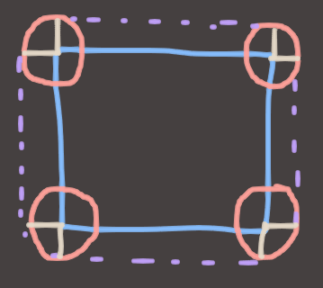

## Solution Number 3: Shit Just Got Real (The Actually Good Method)

Let's try to put all of this shape algebra shit to good practical use in our Moving Circle vs AABB problem. There are, as we saw in previous examples, 3 shapes at play here. There's the circle, there's the AABB, and there's the line segment representing how far the circle will move this frame.

Thanks to Minkowski, we now know that we have options for how we want to phrase the problem. For example, we can **add the circle to the line to get a capsule**, then see if that capsule overlaps the AABB. Or we can **add the AABB to the line** and see if it overlaps the circle. Or we can **add all three and see if they overlap the origin**. *Any of these* will give us our answer, because at the end of the day, it's just algebra. We can re-arrange the equation however we like and still get the correct answer!

So if we can choose any arrangement, which one do we choose? We choose the simplest one to compute, naturally! Or you can choose the one that's easiest for you to think about, that's fine too! For today, I'm going to go with **(AABB + Circle) vs Line Segment** because I think that's easiest and most efficient.

### AABB + Circle

So we have the *general concept* of an AABB + Circle pretty much nailed. It's going to look like a rounded rectangle, axis-aligned, but with rounded edges. We can also probably say that the total width of the rectangle at it's widest point will be the width of the initial AABB, plus twice the radius of the circle.

But how do we test if a point is inside one of these rounded rectangles?

### TO BE CONTINUED WHEN I HAVE TIME <3