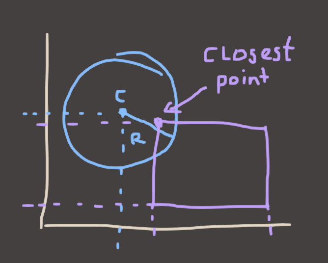

# Euan's Way-Too-Long Collision Detection Thing

Hello everyone, welcome to my TEDTalk. This was supposed to be a quick explainer on basic collision detection of AABBs and Circles, but it kind of ballooned out into a mini-course. I hope it's useful cuz it took way longer than I expected.

## AABB Tests

### Simplify First: One Dimension

Conceptually, an AABB is a set of `n` ranges where `n` is the number of dimensions you're dealing with. To make that a bit more concrete, let's start with one dimension. Consider a line segment.


A "Line" would be the white-ish line in this drawing, and it goes to infinity in both directions. A "Ray" can be defined as "Half A Line". That is, it has a beginning, but it has no end. It starts somewhere and goes to infinity. A "Line Segment" has a beginning *and* an end. There's some terminology for ya!
 
Now let's consider a second line segment:


Now ask yourself the question, **"do these lines overlap?"** The answer is clear from the picture, but if you only had the `min`/`max` values for both lines, could you work it out?

If you were to think about this for a while, you might try to consider all of the cases for how they can overlap, but I'll do you a favour and tell you: it's easier to think of the ways that they can **not** overlap. Why? Because there's only a couple of 'em.


Either the red line segment is completely to the left of the blue one, or the red line is completely to the right of the blue one. If either of those is true, then the lines don't overlap.

Another way of stating this is that

> if the left-most (ie: the minimum) point on the red line is to the right (greater than) of the right-most (maximum) of the blue line, no overlap exists. Or vica verca.

That becomes a simple test to structure!

```!(red.max < blue.min || blue.max < red.min)```

or rephrased to avoid the !..

```(red.max > blue.min && blue.max > red.min)```

### Boxes

So that's cool. But those are lines, lines aren't boxes, fuck off with your lines and min/maxes Euan we're doing boxes today and I don't see any boxes.

Don't worry, we're half way there! we have a 1D test, we just need to extend it into 2D. Consider a box.


Now let's draw some axes on it.


so we already know how to test overlaps on lines. And the X axis is a line, right? so..


If we introduce a second box, we can now do the exact same test to see if they overlap in X.


if they don't overlap in 1D, then they cannot overlap in 2D. Look at this picture and try to imagine a place where you can put the red box where it overlaps with purple, without the min/max ranges overlapping in the X axis. Can't do it! 

That's actually a general truth for all convex shapes, which is cool. But what about if they do overlap in X?


**They still might not overlap.** The way we test to see if they do, as you might've guessed.. is to do the exact same thing we did before. We just do it on the other axis.

### Getting To The Point 

Using our overlapping test idea from before, we can extend to two dimensions.

```
(red.max.x > purple.min.x && purple.max.x > red.min.x)
(red.max.y > purple.min.y && purple.max.y > red.min.y)
```

But there's one question left I guess, which is how do we **combine** these? Is it overlapping if either of the two 1D tests are true? or both of them?

The answer is, it has to be both. Because as we just saw, you can quite happily overlap in one dimension and not the other, and still not be overlapping as a 2D shape. **Every dimension has to overlap for the shapes to actually overlap.**

So our final test is:

```
bool
AABBOverlapsAABB(const AABB& a, const AABB& b)
{
	return
	(a.max.x > b.min.x && b.max.x > a.min.x) &&
	(a.max.y > b.min.y && b.max.y > a.min.y);
}

```

And there's the 2D case. The 3D case would be the exact same thing, you'd just add a .z test in there, in the exact same fashion.

As a sidenote, this is the code for this kind of AABB:

```
struct AABB
{
	Vector2 min, max;
}
```

If your AABBs are stored differently, this might be more what you're looking for. Hopefully you can see how they are equivalent!

```
struct AABB
{
	Vector2 pos, dim;
}

bool
AABBOverlapsAABB(const AABB& a, const AABB& b)
{
	Vector2 aMax = a.pos + a.dim;
	Vector2 bMax = b.pos + b.dim;

	return
	(aMax.x > b.pos.x && bMax.x > a.pos.x) &&
	(aMax.y > b.pos.y && bMax.y > a.pos.y);
}
```

So that's AABB tests in a nutshell. 

## Circles vs AABBs

The next thing you'd probably want is a circle vs AABB test, because balls are not, and this is true.. boxes. The most convenient form for a circle to take when it comes to collision detection is something like this.

```
struct circle
{
	Vector2 center;
	float radius;
}
```

To find whether a circle overlaps with something, you can find the distance between the circle's center and the object you're testing against, and compare that to the circle's radius. If that distance is smaller than the radius, then it's overlapping!


"That's all well and good Euan but how the fuck am I supposed to know where the closest point is?" Great question, and there's two answers, the good one and the easy one. Let's stick to the easy one. Again, let's make life easy by going down to 1D. Imagine a line and a range once again. What is the "closest point" to the red dot on the blue line?


If you think about this problem for a bit, you'll see that there's basically 3 possible solutions. In the picture I showed, the closest point on the line is actually the line's **minimum**. If the red dot were on the other side (to the right of the line) then it would be the **maximum**. And if the dot was somewhere on the line then the **position of the dot itself** would be the closest point.

That's also pretty easy to phrase in code.

```
if(redDot < blueLine.min) return blueLine.min;
if(redDot > blueLine.max) return blueLine.max;
else return redDot;
```

The smart people among you might have noticed that this can also be phrased as:

```
max(blueLine.min, min(blueLine.max, redDot);
```

or even more succinctly, if you have a library that does these things..
```
// Clamp(x, min, max)
Clamp(redDot, blueLine.min, blueLine.max);
```

And once again, this scales to 2 dimensions very easily.



In this example, the `center` of the circle is greater than `max.y` in Y, so we take `max.y`, and less than `min.x` in X, so we take `min.x`.

In code:

```
Vector2
ClosestPointInAABBToPoint(const AABB& aabb, const Vector2& point)
{
	Vector2 result;

	result.x = Clamp(point.x, aabb.min.x, aabb.max.x);
	result.y = Clamp(point.y, aabb.min.y, aabb.max.y);

	return result;
}
```

So now all that's left to do is measure the distance between our circle's center and it's closest point in the AABB. If the point is closer to the circle's center than the radius, then that point is inside the circle, and we have an overlap.

```
bool
CircleOverlapsAABB(const Circle& circle, const AABB& aabb)
{
	Vector2 closestPoint = ClosestPointInAABBToPoint(aabb, circle.center);
	Vector2 difference = closestPoint - circle.center;

	if(magnitude(difference) < circle.radius) return true;
	else return false;
}
```

The magnitude of the vector, as you'll remember from Freya's lectures, just the dot product of a vector and itself. And the Dot product, as you'll also remember, is just the sum of all of the components, multiplied together.

```
float
dot(const Vector2& a, const Vector2& b)
{
	return a.x * b.x + a.y * b.y;
}

float
sqMagnitude(const Vector2& v)
{
	return dot(v, v);
}

float
Vector2::magnitude(const Vector2& v)
{
	return sqrt(sqMagnitude(v));
}
```

If you're fancy, though, you'll probably know that for this kind of `>` or `<` comparison, you don't actually *need* the magnitude of the vector. You can skip the square root and just do this instead: 

```
bool
CircleOverlapsAABB(const Circle& circle, const AABB& aabb)
{
	Vector2 closestPoint = ClosestPointInAABBToPoint(aabb, circle.center);
	Vector2 difference = closestPoint - circle.center;

	return (sqMagnitude(difference) < circle.radius * circle.radius);
}
```

## Now With Movement

Those tests are all well and good if you're dealing with fixed positions, but games where things don't move are not very good games. If you want movement then problems with these techniques start to emerge.

First of all, let's talk about the phenomenon called Tunnelling. Tunnelling is when an electron's wave function collapses on the less probably side of an electric field or what Elon Musk does when he wants to get a taxi from downtown Las Vegas to the airport. It's also a bug in your collision code.


Imagine the earth is hurtling towards a gigantic, but very thin wall, and you're running collision detection to see if it hits the wall or not. (You are God in this scenario)


You first look at the Earth's velocity, and consider how much time has passed since the last time you looked at the Earth. Using this, you work out where the Earth should be, and check to see if it's overlapping.


Damn that's kinda close. No contact though, so it's kosher. (You are Yhwh in this scenario.) So you go off and do something else for a while and then come back later. You repeat the process. Step 1, use Velocity and Time Elapsed to work out where the Earth should be. Step 2, see if that new position collides with anything. Yep, looks good to me! All is good.

Hopefully you see the problem. So what's the solution?

### Solution Number 1: Just Update More, Bro! (The Dumb Method)

+ **PROS:** It's Easy
+ **CONS:** It's Shit

"That's dumb", you say. "Lookit those huge gaps. Only an idiot would have such huge gaps. Just run more updates and you'll be fine."


This is true. This totally works in most cases. But there are edge cases. For example, if we sample twice as often, but objects move twice as fast, then we have the same problems. Another edge case is very small colliders that slot into the lil' gaps.


That's not why it's a dumb solution, though. It's dumb because it's **inherently inaccurate**.

This Earthy Roundboy is about to hit this Bouncy Redboy and we want him to bounce off. We have clearly detected a collision, so now we do the bounce. How do we do that, exactly? Turn him around and throw him in the opposite direction, of course! But.. how do we DO that?

Option 1: He "bounces" from where he is.
Option 2: He "bounces" from where he "collided".


As you can see, neither of these options are what we actually wanted. Either we bounce him early, meaning he never touches the wall and actually bounces without touching, or he embeds himself into the surface then bounces himself out later (potentially causing another collision on the next frame, cuz now he's embedded inside the Bouncy Redboy)

These options both suck. They're inaccurate, and worse still, the degree of inaccuracy is dependent on the speed that Earthy was moving as well as the physics timestep we're choosing. In the worst-case, the consistency of collision detection can become dependent on the framerate! **Can you imagine a game where a lag spike causes you to FALL THROUGH THE FLOOR?!** Because that's the road you're on, my friend.

Clearly we can do better.

### Solution Number 2: Just Binary Search, Bro! (The Big Brain Method)

+ **PROS:** It (mostly) actually works
+ **CONS:** It's a lil' bit more complicated/expensive.

This is why they taught you algorithms dude. To prepare you for *THIS MOMENT*. Brace yerselves.


Imagine a circle that encompasses both the starting point and the projected ending point of our dear Earthy. This new circle would have it's center point in the exact center of the line between the start and end circle centers. I won't give the math away for anyone who wants to think about how to construct this circle, but if you want a hint, the center would be the average of the start and end circle centers and the radius would be half of the total distance, plus whatever the radii are of the two circles.


If we find nothing that collides with this bigger circle, then we know we have no collision and we can do the move, woop! But if we *DO* find a collision, we can, you guessed it, **BINARY SEARCH**! Redo the test, but replace the old endpoint with the midpoint.


If the new test collides, then we know the collision happens in the FIRST half of the travel time. If it doesn't, then we know it happens in the OTHER half. So we change our start and endpoints accordingly!


There's a caveat, though. Y'see this is.. sort of an infinite loop. It gets closer and closer to the right answer with every iteration, but you need to know when to tell it to stop. The best way to do that is to define some minimum timestep that you can take before you call it "good enough", then just exit recursion when you reach that value.

### Seems Good?

Why is this better? First of all, no tunnelling guarantee! Nothing will EVER tunnel in this system.

Second of all, it's as accurate as you want to make it! You choose the minimum timestep, so you choose how good of an answer you wanna get!

Sounds awesome right? Nothing could be better, right? It's got an algorithm in it and everything! Well then..